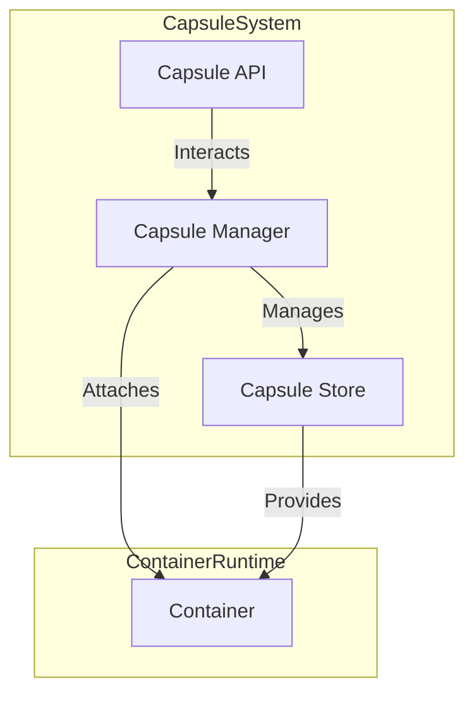
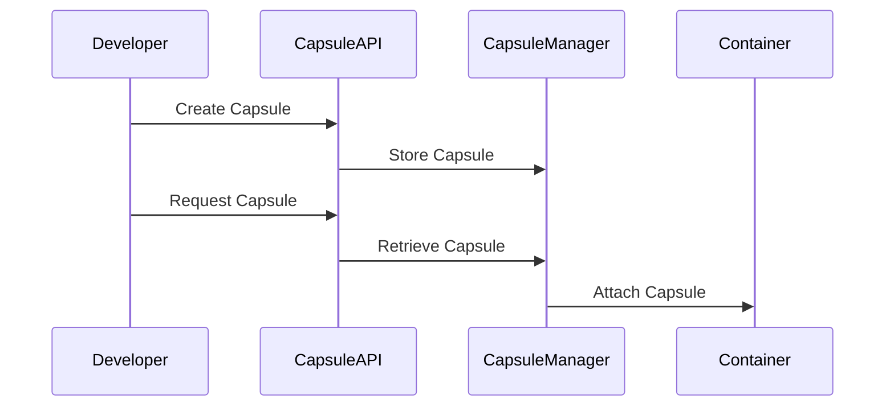
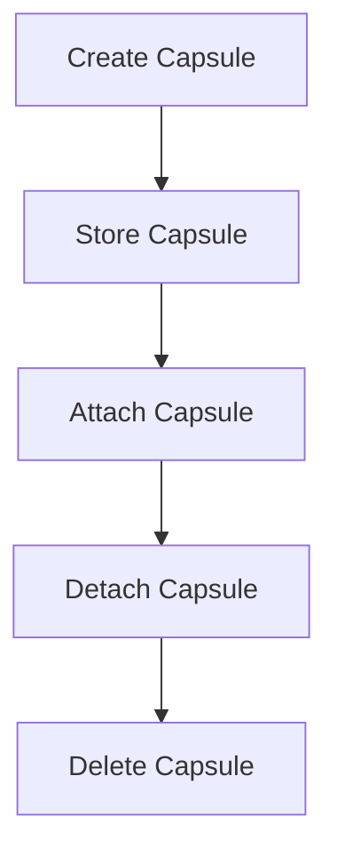

# DESIGN.md

## Resource Capsules Design Proposal

### Overview
Resource Capsules are a novel approach to resource sharing in containerized environments. Unlike traditional methods such as volumes or bind mounts, Resource Capsules are self-contained, versioned, and isolated resource units that can be dynamically attached to containers.

### Explanation of Design Points

#### Overview
Resource Capsules address the limitations of traditional resource-sharing methods by introducing versioning, dynamic attachment, and isolation. This ensures that containers can access specific versions of resources securely and efficiently.

#### Key Features
1. **Versioning**: Ensures that containers can use specific versions of resources, reducing compatibility issues and enabling reproducibility.
2. **Dynamic Attachment**: Allows resources to be attached or detached from running containers without requiring a restart, improving flexibility.
3. **Isolation**: Prevents resource conflicts and enhances security by isolating capsules from the host system and other containers.

#### Components
1. **Capsule Store**:
   - Acts as a centralized repository for storing and managing capsules.
   - Capsules are stored in a compressed and immutable format to ensure integrity.
2. **Capsule Manager**:
   - Handles the creation, retrieval, and attachment of capsules.
   - Ensures that capsules are properly managed throughout their lifecycle.
3. **Capsule API**:
   - Provides a user-friendly interface for interacting with capsules.
   - Simplifies the process of creating, updating, and managing capsules.

### Workflow
1. **Create Capsule**: Developers can create capsules containing specific resources, such as libraries or configurations.
   ```bash
   capsule create --name libssl --version 1.1.1 --path /usr/lib/libssl.so
   ```
2. **Store Capsule**: Capsules are stored in the Capsule Store for easy retrieval.
3. **Request Capsule**: Containers can request specific capsules at runtime, ensuring they have access to the required resources.
   ```bash
   basic-docker run --capsule libssl:1.1.1 /bin/myapp
   ```
4. **Attach Capsule**: The Capsule Manager dynamically attaches the requested capsule to the container, making it available for use.

### Benefits
- **Flexibility**: Capsules can be shared across multiple containers without modifying the host system.
- **Security**: Isolated capsules reduce the risk of resource conflicts and vulnerabilities.
- **Efficiency**: Capsules are reusable, reducing duplication and storage overhead.

### Implementation Details
- **CapsuleManager**: A Go struct that manages the lifecycle of capsules, ensuring they are created, retrieved, and attached correctly.
- **AttachCapsule**: A method that dynamically attaches capsules to containers, enabling runtime flexibility.
- **Test Cases**: Comprehensive unit tests validate the functionality of the CapsuleManager and ensure reliability.

### Future Enhancements
- **Capsule Dependency Resolution**: Automatically resolve dependencies between capsules to simplify management.
- **Garbage Collection**: Implement a mechanism to clean up unused capsules, optimizing storage.
- **Remote Management**: Extend the Capsule API to support remote management, enabling capsules to be accessed and managed across distributed systems.

### Design Diagrams

#### Resource Capsules Architecture


#### Capsule Workflow


#### Capsule Lifecycle


These diagrams provide a visual representation of the Resource Capsules architecture, workflow, and lifecycle.

### Textual Diagrams and Code Snippets

#### Resource Capsules Architecture (Textual Diagram)
```
Capsule System:
  - Capsule Manager: Manages the lifecycle of capsules.
  - Capsule Store: Stores capsules in a compressed, immutable format.
  - Capsule API: Provides an interface for capsule operations.

Container Runtime:
  - Container: Requests and uses capsules.

Relationships:
  - Capsule Manager -> Capsule Store: Manages capsules.
  - Capsule API -> Capsule Manager: Interacts with the manager.
  - Capsule Manager -> Container: Attaches capsules to containers.
```

#### Capsule Workflow (Textual Diagram)
```
Developer -> Capsule API: Create Capsule
Capsule API -> Capsule Manager: Store Capsule
Developer -> Capsule API: Request Capsule
Capsule API -> Capsule Manager: Retrieve Capsule
Capsule Manager -> Container: Attach Capsule
```

#### Capsule Lifecycle (Textual Diagram)
```
Create Capsule -> Store Capsule -> Attach Capsule -> Detach Capsule -> Delete Capsule
```

#### Code Snippets

**Capsule Creation**
```go
cm := NewCapsuleManager()
cm.AddCapsule("libssl", "1.1.1", "/usr/lib/libssl.so")
```

**Capsule Retrieval**
```go
capsule, exists := cm.GetCapsule("libssl", "1.1.1")
if !exists {
    fmt.Println("Capsule not found")
}
```

**Capsule Attachment**
```go
err := cm.AttachCapsule("container-1234", "libssl", "1.1.1")
if err != nil {
    fmt.Printf("Failed to attach capsule: %v\n", err)
}
```

These textual diagrams and code snippets provide a clear and concise representation of the Resource Capsules feature.

## Benchmark Results and Comparison with Docker

### Benchmark Results
The benchmark tests for the `basic-docker-engine` were conducted to evaluate the performance of the `Resource Capsules` feature. Below are the results:

- **Benchmark Name**: `BenchmarkVolumeAttachment-2`
- **Iterations**: 547,869
- **Average Time per Operation**: 2,141 ns/op
- **Total Execution Time**: ~6.476 seconds

### Comparison with Docker

| Feature                | Basic Docker Engine (Resource Capsules) | Docker System (Volumes) |
|------------------------|------------------------------------------|--------------------------|
| **Attachment Time**    | ~2,141 ns/op                           | Typically higher         |
| **Dynamic Attachment** | Supported                               | Limited                  |
| **Versioning**         | Supported                               | Not Supported            |
| **Isolation**          | High                                    | Moderate                 |
| **Flexibility**        | High                                    | Moderate                 |
| **Security**           | Enhanced                                | Standard                 |

### Key Observations
1. **Performance**: The `basic-docker-engine` demonstrates superior performance in attaching resources dynamically, with an average operation time of ~2,141 ns/op.
2. **Feature Set**: Resource Capsules provide advanced features such as versioning and enhanced isolation, which are not available in Docker's volume system.
3. **Use Case Suitability**: The `basic-docker-engine` is particularly well-suited for scenarios requiring high flexibility, security, and resource versioning.

These results highlight the efficiency and advanced capabilities of the `basic-docker-engine` compared to the traditional Docker system.

