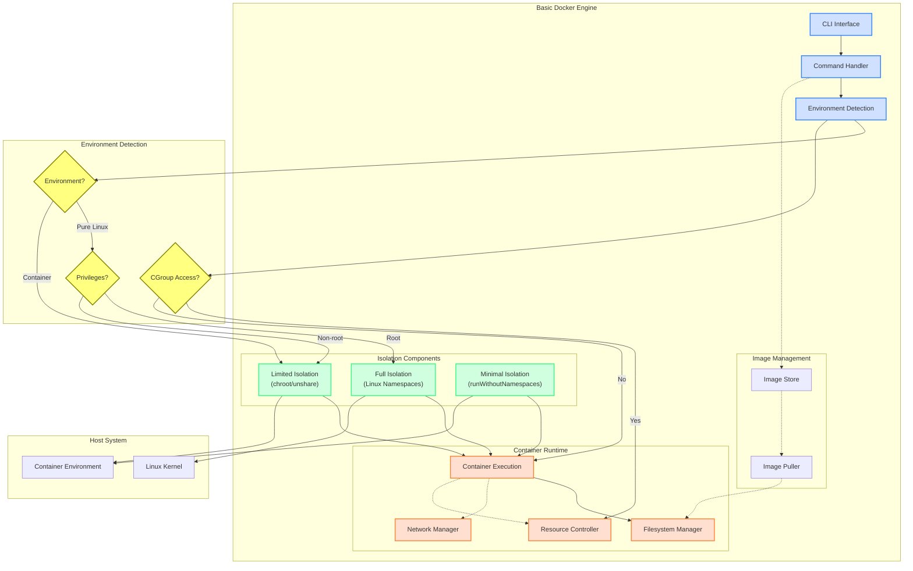
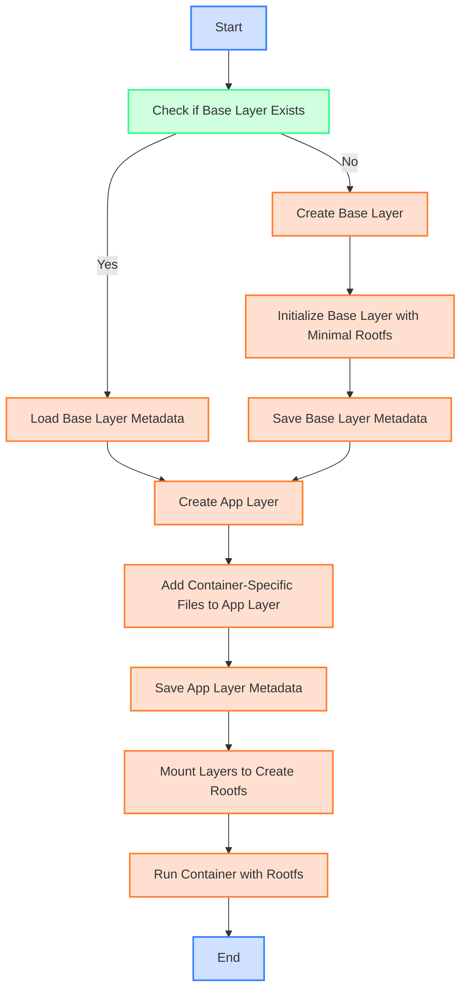

# basic-docker-engine

Basic docker engine implementation from scratch


## Build steps

### build go code

```basic
@j143 ➜ /workspaces/basic-docker-engine (main) $ go build -o basic-docker main.go 
@j143 ➜ /workspaces/basic-docker-engine (main) $ ./basic-docker 
Environment detected: inContainer=true, hasNamespacePrivileges=true, hasCgroupAccess=false
Usage:
  lean-docker run <command> [args...]  - Run a command in a container
  lean-docker ps                       - List running containers
  lean-docker images                   - List available images
  lean-docker info                     - Show system information
```

### create necessary folders

```bash
sudo mkdir -p /tmp/basic-docker/containers
sudo mkdir -p /tmp/basic-docker/images
sudo mkdir -p /sys/fs/cgroup/memory/basic-docker
```

### Set proper permissions

```bash
sudo chmod -R 755 /tmp/basic-docker
sudo chmod -R 755 /sys/fs/cgroup/memory/basic-docker
```

### Run a simple command in a container

> Note: This needs to be run as root due to namespace operations

sudo ./basic-docker run /bin/sh -c "echo Hello from container"


>  $ sudo ./basic-docker run /bin/sh -c "echo Hello from container"
> Starting container container-1743306338
> Error: failed to set memory limit: open /sys/fs/cgroup/memory/basic-docker/container-1743306338/memory.limit_in_bytes: permission denied
>

## Architecture




## Image Build Logic



The logic implemented for building images and running containers in the basic Docker engine.
It starts by checking if the base layer exists, initializes it if necessary, and then creates an app layer for container-specific files.
Finally, the layers are mounted to create the root filesystem, and the container is executed.

## Basic docker prompts

### `basic-docker info`

```bash
/workspaces/basic-docker-engine (main) $ ./basic-docker info
Environment detected: inContainer=true, hasNamespacePrivileges=true, hasCgroupAccess=false
Lean Docker Engine - System Information
=======================================
Go version: go1.24.1
OS/Arch: linux/amd64
Running in container: true
Namespace privileges: true
Cgroup access: false
Available features:
  - Process isolation: true
  - Network isolation: true
  - Resource limits: false
  - Filesystem isolation: true
```

### `basic-docker run`

```bash
/workspaces/basic-docker-engine (main) $ ./basic-docker run /bin/echo "Hello from container"
Environment detected: inContainer=true, hasNamespacePrivileges=true, hasCgroupAccess=false
Starting container container-1743307284
unshare: unshare failed: Operation not permitted
Error: exit status 1
Container container-1743307284 exited

@j143 ➜ /workspaces/basic-docker-engine (main) $ sudo ./basic-docker run /bin/echo "Hello from container"
Environment detected: inContainer=true, hasNamespacePrivileges=true, hasCgroupAccess=true
Starting container container-1743307290
Hello from container
Container container-1743307290 exited
```


### `basic-docker ps`

```bash
@j143 ➜ /workspaces/basic-docker-engine (main) $ sudo ./basic-docker ps
Environment detected: inContainer=true, hasNamespacePrivileges=true, hasCgroupAccess=true
CONTAINER ID    STATUS  COMMAND
container-1743307284    N/A     N/A
container-1743307290    N/A     N/A
```

### `basic-docker run /bin/sh`

```bash
@j143 ➜ /workspaces/basic-docker-engine (main) $ sudo ./basic-docker run /bin/echo "Hello from container"
Environment detected: inContainer=true, hasNamespacePrivileges=true, hasCgroupAccess=true
Starting container container-1743307567
Hello from container
Container container-1743307567 exited
```

## `basic-docker run /bin/busybox`

```bash
@j143 ➜ /workspaces/basic-docker-engine (main) $ sudo ./basic-docker run /bin/busybox echo "Hello from BusyBox"
Environment detected: inContainer=true, hasNamespacePrivileges=true, hasCgroupAccess=false
Starting container container-1744512443
Hello from BusyBox
Container container-1744512443 exited
```


## Verify the prompt functionality

```
@j143 ➜ /workspaces/basic-docker-engine (main) $ chmod +x verify.sh 
@j143 ➜ /workspaces/basic-docker-engine (main) $ ./verify.sh 
==== System Information ====
Environment detected: inContainer=true, hasNamespacePrivileges=true, hasCgroupAccess=false
Lean Docker Engine - System Information
=======================================
Go version: go1.24.1
OS/Arch: linux/amd64
Running in container: true
Namespace privileges: true
Cgroup access: false
Available features:
  - Process isolation: true
  - Network isolation: true
  - Resource limits: false
  - Filesystem isolation: true
===========================


==== Running Simple Command ====
Environment detected: inContainer=true, hasNamespacePrivileges=true, hasCgroupAccess=true
Starting container container-1743307590
Hello from container
Container container-1743307590 exited


==== Listing Containers ====
Environment detected: inContainer=true, hasNamespacePrivileges=true, hasCgroupAccess=true
CONTAINER ID    STATUS  COMMAND
container-1743307284    N/A     N/A
container-1743307290    N/A     N/A
container-1743307567    N/A     N/A
container-1743307590    N/A     N/A


==== Testing with busybox ====
Environment detected: inContainer=true, hasNamespacePrivileges=true, hasCgroupAccess=true
Starting container container-1743307590
Error: failed to create symlink for sh: symlink busybox /tmp/lean-docker/containers/container-1743307590/rootfs/bin/sh: file exists


==== Skipping isolation tests (needs root) ====


==== All tests completed ====
```