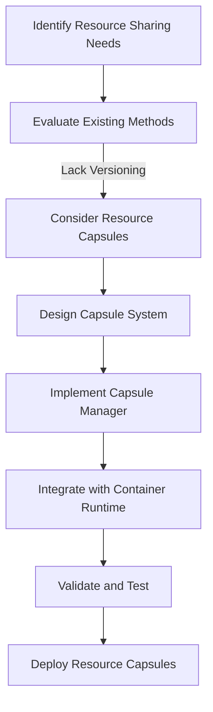

# Architectural Decision Record (ADR)

## ADR-001: Resource Capsules

### Context
In containerized environments, resource sharing is typically achieved through volumes or bind mounts. However, these methods lack versioning, dynamic attachment capabilities, and isolation, which are critical for modern containerized applications.

### Decision
We decided to implement **Resource Capsules**, a novel approach to resource sharing that provides versioning, dynamic attachment, and isolation. This decision aligns with the goals of enhancing flexibility, security, and efficiency in resource management.

### Consequences
#### Positive
- **Versioning**: Enables containers to use specific versions of shared resources.
- **Dynamic Attachment**: Allows capsules to be attached or detached from running containers without restarting them.
- **Isolation**: Ensures resources are secure and consistent across containers.
- **Reusability**: Capsules can be reused across multiple containers, reducing duplication.

#### Negative
- **Complexity**: Adds additional components like Capsule Manager and Capsule Store.
- **Overhead**: Requires managing capsule lifecycle and storage.

### Alternatives Considered
1. **Traditional Volumes**:
   - Pros: Simple and widely used.
   - Cons: No versioning or dynamic attachment capabilities.
2. **Bind Mounts**:
   - Pros: Direct access to host resources.
   - Cons: Security risks and lack of isolation.

### Status
Accepted and implemented in the `resource-capsules` branch.

### Design Diagram

#### Resource Capsules Decision Flow

This diagram illustrates the decision-making process for adopting Resource Capsules.

### Writing Best Practices
- **Clarity**: Use simple and direct language to explain the decision.
- **Conciseness**: Avoid unnecessary details; focus on the key points.
- **Structure**: Organize the document into clear sections with headings.
- **Consistency**: Use consistent terminology and formatting throughout the document.

### Future Work
- Extend Capsule API for remote management.
- Implement garbage collection for unused capsules.
- Add support for capsule dependency resolution.