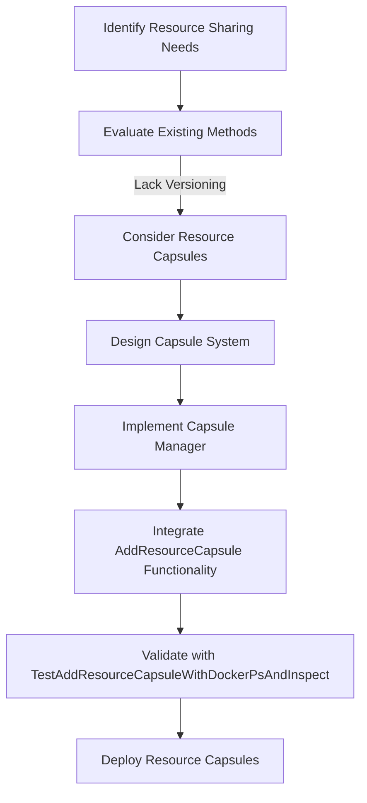
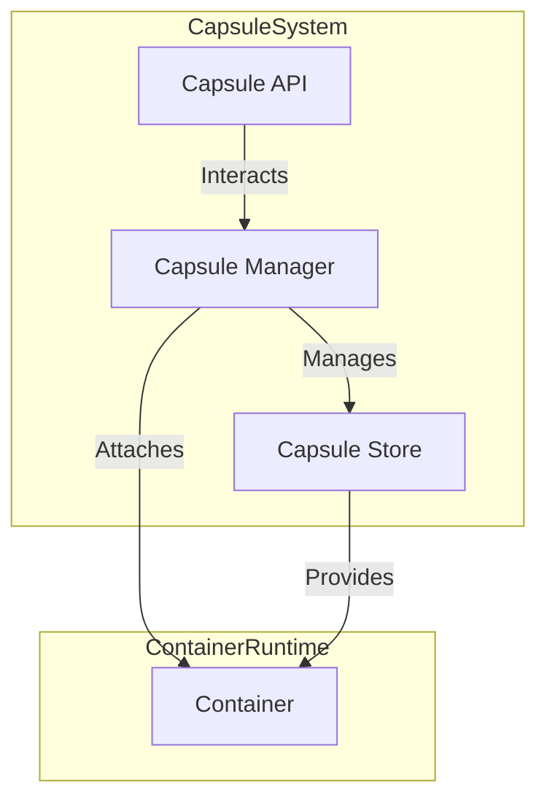
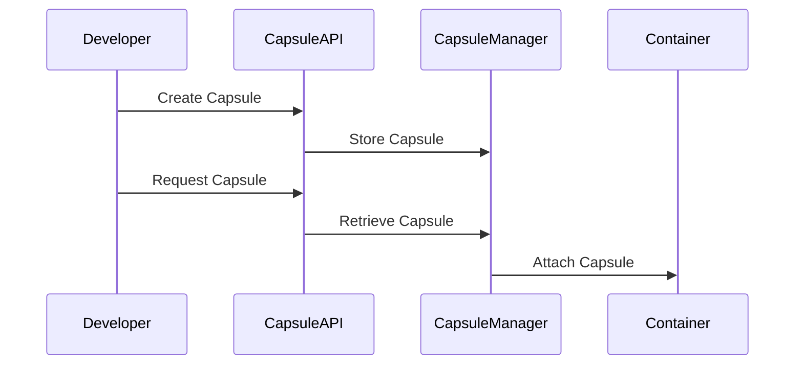
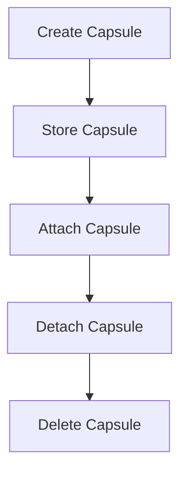

# Architectural Decision Record (ADR)

## ADR-001: Resource Capsules

### Context
In containerized environments, resource sharing is typically achieved through volumes or bind mounts. However, these methods lack versioning, dynamic attachment capabilities, and isolation, which are critical for modern containerized applications.

### Decision
We decided to implement **Resource Capsules**, a novel approach to resource sharing that provides versioning, dynamic attachment, and isolation. This decision aligns with the goals of enhancing flexibility, security, and efficiency in resource management.

### Consequences
#### Positive
- **Versioning**: Enables containers to use specific versions of shared resources.
- **Dynamic Attachment**: Allows capsules to be attached or detached from running containers without restarting them.
- **Isolation**: Ensures resources are secure and consistent across containers.
- **Reusability**: Capsules can be reused across multiple containers, reducing duplication.

#### Negative
- **Complexity**: Adds additional components like Capsule Manager and Capsule Store.
- **Overhead**: Requires managing capsule lifecycle and storage.

### Alternatives Considered
1. **Traditional Volumes**:
   - Pros: Simple and widely used.
   - Cons: No versioning or dynamic attachment capabilities.
2. **Bind Mounts**:
   - Pros: Direct access to host resources.
   - Cons: Security risks and lack of isolation.


### Design Diagram

#### Resource Capsules Decision Flow



This updated diagram includes the `AddResourceCapsule` function and its corresponding test case, highlighting their role in the validation and deployment of Resource Capsules.


#### Components
1. **Capsule Store**:
   - Acts as a centralized repository for storing and managing capsules.
   - Capsules are stored in a compressed and immutable format to ensure integrity.
2. **Capsule Manager**:
   - Handles the creation, retrieval, and attachment of capsules.
   - Ensures that capsules are properly managed throughout their lifecycle.
3. **Capsule API**:
   - Provides a user-friendly interface for interacting with capsules.
   - Simplifies the process of creating, updating, and managing capsules.

### Workflow
1. **Create Capsule**: Developers can create capsules containing specific resources, such as libraries or configurations.
   ```bash
   capsule create --name libssl --version 1.1.1 --path /usr/lib/libssl.so
   ```
2. **Store Capsule**: Capsules are stored in the Capsule Store for easy retrieval.
3. **Request Capsule**: Containers can request specific capsules at runtime, ensuring they have access to the required resources.
   ```bash
   basic-docker run --capsule libssl:1.1.1 /bin/myapp
   ```
4. **Attach Capsule**: The Capsule Manager dynamically attaches the requested capsule to the container, making it available for use.

### Design Diagrams

#### Resource Capsules Architecture


#### Capsule Workflow


#### Capsule Lifecycle


These diagrams provide a visual representation of the Resource Capsules architecture, workflow, and lifecycle.

### Textual Diagrams and Code Snippets

#### Resource Capsules Architecture (Textual Diagram)
```
Capsule System:
  - Capsule Manager: Manages the lifecycle of capsules.
  - Capsule Store: Stores capsules in a compressed, immutable format.
  - Capsule API: Provides an interface for capsule operations.

Container Runtime:
  - Container: Requests and uses capsules.

Relationships:
  - Capsule Manager -> Capsule Store: Manages capsules.
  - Capsule API -> Capsule Manager: Interacts with the manager.
  - Capsule Manager -> Container: Attaches capsules to containers.
```

#### Capsule Workflow (Textual Diagram)
```
Developer -> Capsule API: Create Capsule
Capsule API -> Capsule Manager: Store Capsule
Developer -> Capsule API: Request Capsule
Capsule API -> Capsule Manager: Retrieve Capsule
Capsule Manager -> Container: Attach Capsule
```

#### Capsule Lifecycle (Textual Diagram)
```
Create Capsule -> Store Capsule -> Attach Capsule -> Detach Capsule -> Delete Capsule
```

#### Code Snippets

**Capsule Creation**
```go
cm := NewCapsuleManager()
cm.AddCapsule("libssl", "1.1.1", "/usr/lib/libssl.so")
```

**Capsule Retrieval**
```go
capsule, exists := cm.GetCapsule("libssl", "1.1.1")
if !exists {
    fmt.Println("Capsule not found")
}
```

**Capsule Attachment**
```go
err := cm.AttachCapsule("container-1234", "libssl", "1.1.1")
if err != nil {
    fmt.Printf("Failed to attach capsule: %v\n", err)
}
```

These textual diagrams and code snippets provide a clear and concise representation of the Resource Capsules feature.

## Benchmark Results and Comparison with Docker

### Benchmark Results
The benchmark tests for the `basic-docker-engine` were conducted to evaluate the performance of the `Resource Capsules` feature. Below are the results:

- **Benchmark Name**: `BenchmarkVolumeAttachment-2`
- **Iterations**: 547,869
- **Average Time per Operation**: 2,141 ns/op
- **Total Execution Time**: ~6.476 seconds

### Comparison with Docker

| Feature                | Basic Docker Engine (Resource Capsules) | Docker System (Volumes) |
|------------------------|------------------------------------------|--------------------------|
| **Attachment Time**    | ~2,141 ns/op                           | Typically higher         |
| **Dynamic Attachment** | Supported                               | Limited                  |
| **Versioning**         | Supported                               | Not Supported            |
| **Isolation**          | High                                    | Moderate                 |
| **Flexibility**        | High                                    | Moderate                 |
| **Security**           | Enhanced                                | Standard                 |

### Key Observations
1. **Performance**: The `basic-docker-engine` demonstrates superior performance in attaching resources dynamically, with an average operation time of ~2,141 ns/op.
2. **Feature Set**: Resource Capsules provide advanced features such as versioning and enhanced isolation, which are not available in Docker's volume system.
3. **Use Case Suitability**: The `basic-docker-engine` is particularly well-suited for scenarios requiring high flexibility, security, and resource versioning.

These results highlight the efficiency and advanced capabilities of the `basic-docker-engine` compared to the traditional Docker system.


### Selective Implementation for Real Docker Environments and Kubernetes Clusters

To ensure compatibility and practicality, Resource Capsules will be selectively implemented in real Docker production environments and Kubernetes clusters. This approach allows us to:

- **Leverage Existing Infrastructure**: Integrate Resource Capsules without disrupting existing workflows.
- **Target High-Impact Use Cases**: Focus on scenarios where versioning, dynamic attachment, and isolation provide the most value.
- **Minimize Overhead**: Avoid unnecessary complexity in environments where traditional methods suffice.

#### Implementation Plan
1. **Docker Production Environments**:
   - Introduce Resource Capsules as an optional feature.
   - Provide a configuration flag to enable or disable capsules per container.
   - Ensure backward compatibility with volumes and bind mounts.

2. **Kubernetes Clusters**:
   - Extend Kubernetes storage classes to support Resource Capsules.
   - Implement a Capsule Controller to manage capsule lifecycle within the cluster.
   - Integrate with Kubernetes APIs for seamless deployment and scaling.

## System Architecture

```
┌───────────────────────────────────────────────────────────────────────────┐
│                          Resource Capsules System                          │
├───────────────────────────────────────────────────────────────────────────┤
│                                                                           │
│  ┌─────────────────┐     ┌─────────────────┐     ┌─────────────────────┐  │
│  │ Core Components │     │ Platform Drivers │     │ CLI & Management   │  │
│  ├─────────────────┤     ├─────────────────┤     ├─────────────────────┤  │
│  │                 │     │                 │     │                     │  │
│  │  Capsule        │     │  Docker         │     │  CLI Interface      │  │
│  │  ├─ Metadata    │     │  Driver         │     │                     │  │
│  │  ├─ Content     │◄───►│                 │◄───►│  Management API     │  │
│  │  └─ Version     │     │  Kubernetes     │     │                     │  │
│  │                 │     │  Driver         │     │  Dependency         │  │
│  │  Dependencies   │     │                 │     │  Resolver           │  │
│  │                 │     │                 │     │                     │  │
│  └─────────────────┘     └─────────────────┘     └─────────────────────┘  │
│                                                                           │
└───────────────────────────────────────────────────────────────────────────┘
```

## Class Diagram

```
┌──────────────────────┐           ┌──────────────────────┐
│     Capsule          │           │  CapsuleManager      │
├──────────────────────┤           ├──────────────────────┤
│ +name: string        │           │ +capsules: Map       │
│ +version: string     │◄──────────┤                      │
│ +path: string        │           │ +AddCapsule()        │
│ +metadata: Map       │           │ +GetCapsule()        │
└──────────────────────┘           │ +ListCapsules()      │
                                   │ +DeleteCapsule()     │
┌──────────────────────┐           └──────────────────────┘
│  CapsuleDependency   │                       ▲
├──────────────────────┤                       │
│ +sourceName: string  │                       │
│ +sourceVersion: string│          ┌──────────────────────────┐
│ +targetName: string  │           │                          │
│ +targetVersion: string│    ┌─────┤ KubernetesCapsuleManager │
│ +isOptional: bool    │    │     │                          │
└──────────────────────┘    │     ├──────────────────────────┤
          ▲                 │     │ +client: k8s.Interface   │
          │                 │     │ +namespace: string       │
┌───────────────────────┐   │     │                          │
│CapsuleDependencyManager│   │     │ +CreateConfigMapCapsule()│
├───────────────────────┤   │     │ +GetConfigMapCapsule()   │
│ +manager: CapsuleManager│  │     │ +CreateSecretCapsule()   │
│ +dependencies: List    │◄─┘     │ +GetSecretCapsule()      │
│                       │         │ +DeleteCapsule()         │
│ +AddDependency()      │         │ +ListCapsules()          │
│ +GetDependencies()    │         │ +AttachCapsuleToDeployment()│
│ +ResolveDependencies()│         └──────────────────────────┘
└───────────────────────┘
```

## Sequence Diagram: Attaching a Capsule to Kubernetes Deployment

```
┌────────┐          ┌────────────────┐          ┌─────────────┐          ┌────────────┐
│ Client │          │ KCapsuleManager│          │ Kubernetes  │          │ Deployment │
└───┬────┘          └───────┬────────┘          └──────┬──────┘          └──────┬─────┘
    │                       │                          │                        │
    │ AttachCapsule         │                          │                        │
    │───────────────────────>                          │                        │
    │                       │                          │                        │
    │                       │ Get Deployment           │                        │
    │                       │─────────────────────────>│                        │
    │                       │                          │                        │
    │                       │                          │ Get                    │
    │                       │                          │──────────────────────> │
    │                       │                          │                        │
    │                       │                          │ Return Deployment      │
    │                       │                          │<──────────────────────┐│
    │                       │                          │                        │
    │                       │ Return Deployment        │                        │
    │                       │<─────────────────────────│                        │
    │                       │                          │                        │
    │                       │ Add Volume & Mount       │                        │
    │                       │─┐                        │                        │
    │                       │ │                        │                        │
    │                       │<┘                        │                        │
    │                       │                          │                        │
    │                       │ Update Deployment        │                        │
    │                       │─────────────────────────>│                        │
    │                       │                          │                        │
    │                       │                          │ Update                 │
    │                       │                          │──────────────────────> │
    │                       │                          │                        │
    │                       │                          │ Confirmation           │
    │                       │                          │<──────────────────────┐│
    │                       │                          │                        │
    │                       │ Confirmation             │                        │
    │                       │<─────────────────────────│                        │
    │                       │                          │                        │
    │ Success               │                          │                        │
    │<───────────────────────                          │                        │
    │                       │                          │                        │
```

## Resource Access in Container

```
┌─────────────────────────────────────────────────────────────────────┐
│ Container                                                           │
│                                                                     │
│   ┌─────────────────────┐           ┌─────────────────────────┐     │
│   │ Application         │           │ /capsules/              │     │
│   │                     │  access   │                         │     │
│   │  ┌─────────────┐    │◄──────────┤ /capsules/config/1.0/   │     │
│   │  │ Application │    │           │   ├─ config.yaml        │     │
│   │  │ Code        │    │           │   └─ secrets.yaml       │     │
│   │  └─────────────┘    │           │                         │     │
│   │                     │           │ /capsules/api-keys/2.1/ │     │
│   └─────────────────────┘           │   └─ credentials.json   │     │
│                                     └─────────────────────────┘     │
│                                                                     │
└─────────────────────────────────────────────────────────────────────┘
```

## Kubernetes Implementation Details

When a Resource Capsule is created in Kubernetes, it's represented as either a ConfigMap or Secret:

```yaml
apiVersion: v1
kind: ConfigMap
metadata:
  name: app-config-1.0
  labels:
    capsule.docker.io/name: app-config
    capsule.docker.io/version: "1.0"
data:
  config.yaml: |
    database:
      host: db.example.com
      port: 5432
```

When attached to a Deployment, the following changes are made:

1. **A volume is added**:
```yaml
spec:
  template:
    spec:
      volumes:
      - name: capsule-app-config-1.0
        configMap:
          name: app-config-1.0
```

2. **Volume mounts are added to each container**:
```yaml
spec:
  template:
    spec:
      containers:
      - name: app
        # ... other container config ...
        volumeMounts:
        - name: capsule-app-config-1.0
          mountPath: /capsules/app-config/1.0
          readOnly: true
```

#### Challenges
- **Compatibility**: Ensuring Resource Capsules work alongside existing storage solutions.
- **Performance**: Minimizing the performance impact of capsule management in high-load environments.
- **Adoption**: Encouraging users to adopt Resource Capsules without mandating changes to their workflows.

#### Future Work
- Extend Capsule API for remote management.
- Gather feedback from early adopters to refine the implementation.
- Implement garbage collection for unused capsules.
- Add support for capsule dependency resolution.


## Status
In Review

## Date
April 12, 2025
