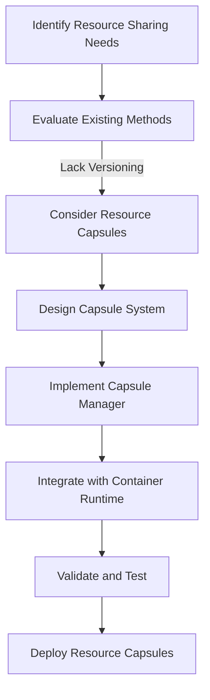
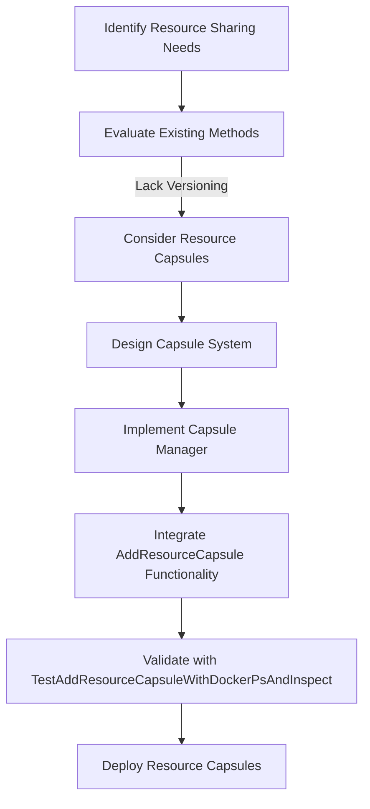

# Architectural Decision Record (ADR)

## ADR-001: Resource Capsules

### Context
In containerized environments, resource sharing is typically achieved through volumes or bind mounts. However, these methods lack versioning, dynamic attachment capabilities, and isolation, which are critical for modern containerized applications.

### Decision
We decided to implement **Resource Capsules**, a novel approach to resource sharing that provides versioning, dynamic attachment, and isolation. This decision aligns with the goals of enhancing flexibility, security, and efficiency in resource management.

### Consequences
#### Positive
- **Versioning**: Enables containers to use specific versions of shared resources.
- **Dynamic Attachment**: Allows capsules to be attached or detached from running containers without restarting them.
- **Isolation**: Ensures resources are secure and consistent across containers.
- **Reusability**: Capsules can be reused across multiple containers, reducing duplication.

#### Negative
- **Complexity**: Adds additional components like Capsule Manager and Capsule Store.
- **Overhead**: Requires managing capsule lifecycle and storage.

### Alternatives Considered
1. **Traditional Volumes**:
   - Pros: Simple and widely used.
   - Cons: No versioning or dynamic attachment capabilities.
2. **Bind Mounts**:
   - Pros: Direct access to host resources.
   - Cons: Security risks and lack of isolation.

### Status
Accepted and implemented in the `resource-capsules` branch.

### Design Diagram

#### Resource Capsules Decision Flow

This diagram illustrates the decision-making process for adopting Resource Capsules.

### Updated Design Diagram

#### Resource Capsules with AddResourceCapsule Integration

This updated diagram includes the `AddResourceCapsule` function and its corresponding test case, highlighting their role in the validation and deployment of Resource Capsules.

### Future Work
- Extend Capsule API for remote management.
- Implement garbage collection for unused capsules.
- Add support for capsule dependency resolution.

### Selective Implementation for Real Docker Environments and Kubernetes Clusters

To ensure compatibility and practicality, Resource Capsules will be selectively implemented in real Docker production environments and Kubernetes clusters. This approach allows us to:

- **Leverage Existing Infrastructure**: Integrate Resource Capsules without disrupting existing workflows.
- **Target High-Impact Use Cases**: Focus on scenarios where versioning, dynamic attachment, and isolation provide the most value.
- **Minimize Overhead**: Avoid unnecessary complexity in environments where traditional methods suffice.

#### Implementation Plan
1. **Docker Production Environments**:
   - Introduce Resource Capsules as an optional feature.
   - Provide a configuration flag to enable or disable capsules per container.
   - Ensure backward compatibility with volumes and bind mounts.

2. **Kubernetes Clusters**:
   - Extend Kubernetes storage classes to support Resource Capsules.
   - Implement a Capsule Controller to manage capsule lifecycle within the cluster.
   - Integrate with Kubernetes APIs for seamless deployment and scaling.

#### Challenges
- **Compatibility**: Ensuring Resource Capsules work alongside existing storage solutions.
- **Performance**: Minimizing the performance impact of capsule management in high-load environments.
- **Adoption**: Encouraging users to adopt Resource Capsules without mandating changes to their workflows.

#### Future Work
- Develop detailed documentation and best practices for using Resource Capsules in these environments.
- Gather feedback from early adopters to refine the implementation.
- Explore automation tools to simplify capsule management in large-scale deployments.

## Status
In Review

## Date
April 12, 2025
