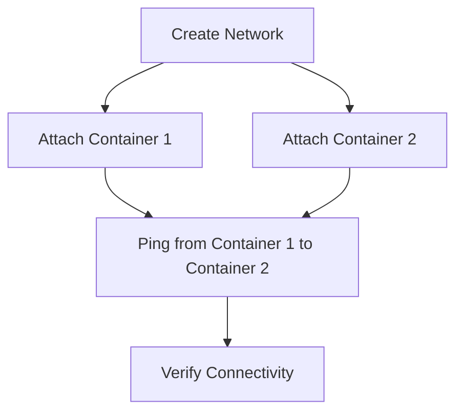
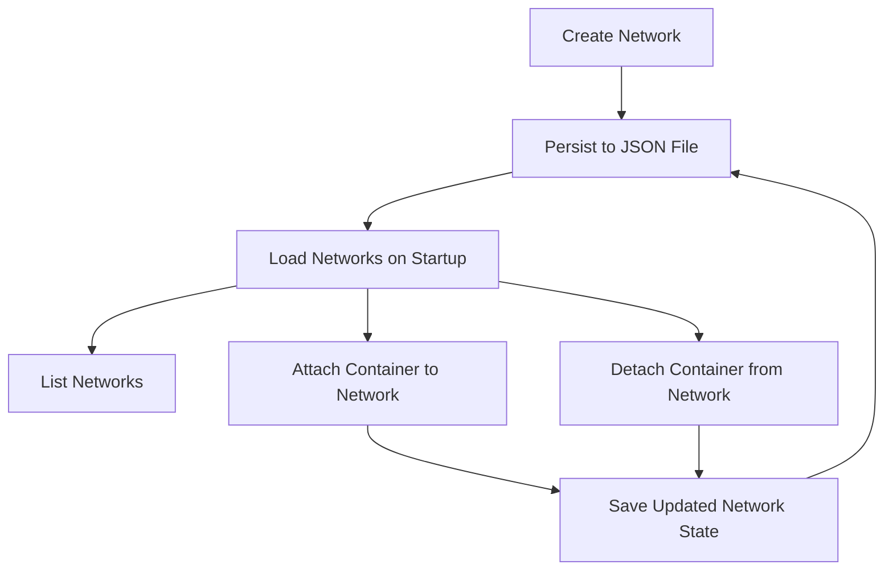

# ADR-002: Networking Stack for Basic Docker Engine

## Context
The Basic Docker Engine requires a networking stack to enable communication between containers and the host system. The networking stack should be simple, lightweight, and easy to use, aligning with the overall philosophy of the project.

## Design Goals
1. **Simplicity**: The networking stack should be easy to understand and use, with minimal configuration required.
2. **Lightweight**: Avoid unnecessary complexity or dependencies, keeping the implementation lean.
3. **Extensibility**: Provide a foundation that can be extended in the future to support advanced networking features.
4. **Isolation**: Ensure that containers within the same network can communicate while maintaining isolation from other networks.

## Decision
We implemented a basic networking stack with the following features:

1. **Network Management**:
   - Ability to create, list, and delete networks.
   - Networks are identified by a unique ID and a user-defined name.
   - Networks are persisted to a JSON file (`networks.json`) to ensure they survive program restarts.

2. **Container-to-Container Communication**:
   - Containers within the same network can communicate with each other.
   - Communication across networks is not supported in this initial implementation.

3. **Host Communication**:
   - Containers can communicate with the host system if required.

4. **Integration with Resource Capsules**:
   - Networks are treated as resource capsules, enabling versioning and dynamic attachment/detachment of containers.

5. **Implementation Details**:
   - Networks are managed in-memory and persisted to a JSON file.
   - Commands for managing networks are added to the CLI (`network-create`, `network-list`, `network-delete`, `network-attach`, `network-detach`).

## API and Code Snippets

### Network Management API

#### Create a Network
```go
func CreateNetwork(name string) {
	id := fmt.Sprintf("net-%d", len(networks)+1)
	network := Network{Name: name, ID: id, Containers: []string{}}
	networks = append(networks, network)

	// Register the network as a resource capsule
	capsuleManager.AddCapsule(name, "1.0", id)
	saveNetworks()
	fmt.Printf("Network capsule %s created with ID %s\n", name, id)
}
```

#### List Networks
```go
func ListNetworks() {
	fmt.Println("Available Networks:")
	for _, network := range networks {
		fmt.Printf("- %s (ID: %s)\n", network.Name, network.ID)
	}
}
```

#### Delete a Network
```go
func DeleteNetwork(id string) {
	for i, network := range networks {
		if network.ID == id {
			networks = append(networks[:i], networks[i+1:]...)
			saveNetworks()
			fmt.Printf("Network with ID %s deleted\n", id)
			return
		}
	}
	fmt.Printf("Network with ID %s not found\n", id)
}
```

#### Attach a Container to a Network
```go
func AttachContainerToNetwork(networkID, containerID string) error {
	for i, network := range networks {
		if network.ID == networkID {
			// Check if the container is already attached
			for _, c := range network.Containers {
				if c == containerID {
					return errors.New("container is already attached to the network")
				}
			}
			// Attach the container
			networks[i].Containers = append(network.Containers, containerID)
			saveNetworks()
			fmt.Printf("Container %s attached to network %s\n", containerID, networkID)
			return nil
		}
	}
	return errors.New("network not found")
}
```

#### Detach a Container from a Network
```go
func DetachContainerFromNetwork(networkID, containerID string) error {
	for i, network := range networks {
		if network.ID == networkID {
			// Find and remove the container
			for j, c := range network.Containers {
				if c == containerID {
					networks[i].Containers = append(network.Containers[:j], network.Containers[j+1:]...)
					saveNetworks()
					fmt.Printf("Container %s detached from network %s\n", containerID, networkID)
					return nil
				}
			}
			return errors.New("container not found in the network")
		}
	}
	return errors.New("network not found")
}
```

### Persistence
Networks are persisted to a JSON file (`networks.json`) using the following functions:

#### Save Networks
```go
func saveNetworks() {
	filePath := filepath.Join(baseDir, networksFile)
	file, err := os.Create(filePath)
	if err != nil {
		fmt.Printf("Error saving networks: %v\n", err)
		return
	}
	defer file.Close()

	encoder := json.NewEncoder(file)
	if err := encoder.Encode(networks); err != nil {
		fmt.Printf("Error encoding networks: %v\n", err)
	}
}
```

#### Load Networks
```go
func loadNetworks() {
	filePath := filepath.Join(baseDir, networksFile)
	file, err := os.Open(filePath)
	if err != nil {
		if os.IsNotExist(err) {
			return // No networks file exists yet
		}
		fmt.Printf("Error loading networks: %v\n", err)
		return
	}
	defer file.Close()

	decoder := json.NewDecoder(file)
	if err := decoder.Decode(&networks); err != nil {
		fmt.Printf("Error decoding networks: %v\n", err)
	}
}
```

### CLI Commands
- `network-create <network-name>`: Create a new network.
- `network-list`: List all networks.
- `network-delete <network-id>`: Delete a network by ID.
- `network-attach <network-id> <container-id>`: Attach a container to a network.
- `network-detach <network-id> <container-id>`: Detach a container from a network.

## New Functionality: Ping Between Containers

### Context
To verify connectivity between containers in the same network, a `Ping` function was introduced. This function simulates a ping operation by checking if both containers are attached to the same network and outputs a success message if they are.

### Implementation
The `Ping` function was added to the networking stack with the following signature:

```go
func Ping(networkID, sourceContainerID, targetContainerID string) error {
	for _, network := range networks {
		if network.ID == networkID {
			sourceIP, sourceExists := network.Containers[sourceContainerID]
			targetIP, targetExists := network.Containers[targetContainerID]

			if !sourceExists || !targetExists {
				return errors.New("one or both containers are not in the network")
			}

			fmt.Printf("Pinging from %s to %s: Success\n", sourceIP, targetIP)
			return nil
		}
	}
	return errors.New("network not found")
}
```

### Test Scenario
A test case, `TestPing`, was added to validate this functionality. The test performs the following steps:
1. Creates a network.
2. Attaches two containers to the network.
3. Verifies that the `Ping` function confirms connectivity between the two containers.

#### Test Code
```go
func TestPing(t *testing.T) {
	// Setup: Create a network and attach two containers
	networkName := "test-network"
	CreateNetwork(networkName)
	networkID := networks[0].ID

	container1 := "container-1"
	container2 := "container-2"

	err := AttachContainerToNetwork(networkID, container1)
	if err != nil {
		t.Fatalf("Failed to attach container 1: %v", err)
	}

	err = AttachContainerToNetwork(networkID, container2)
	if err != nil {
		t.Fatalf("Failed to attach container 2: %v", err)
	}

	err = Ping(networkID, container1, container2)
	if err != nil {
		t.Errorf("Ping failed: %v", err)
	}
}
```

### Test Output

The `TestPing` test case was executed successfully, confirming the functionality of the `Ping` feature. Below is the textual output from the test:

```
Network capsule test-network created with ID net-1
Container container-1 attached to network net-1 with IP 192.168.1.2
Container container-2 attached to network net-1 with IP 192.168.1.3
Pinging from 192.168.1.2 to 192.168.1.3: Success
```

This output demonstrates that:
1. A network was created successfully.
2. Containers were attached to the network with unique IP addresses.
3. The `Ping` function verified connectivity between the containers.

## Test Overview

### Purpose
To ensure that containers within the same network can communicate effectively.

### Approach
A basic test was implemented to:
1. Create a network.
2. Attach two containers to the network.
3. Verify connectivity between the containers using a simulated `Ping` function.

### Diagram


## Test Diagram for Containers 1, 2, and 3

To illustrate the test scenario involving containers 1, 2, and 3 across two networks, the following diagram has been added:

```mermaid
graph TD
    A[Create Network 1] --> B[Attach Container 1 to Network 1]
    A --> C[Attach Container 2 to Network 1]
    D[Create Network 2] --> E[Attach Container 3 to Network 2]
    B --> F[Ping from Container 1 to Container 2 (Success)]
    C --> F
    B --> G[Ping from Container 1 to Container 3 (Fail)]
    E --> G
```

This diagram visually represents the relationships and ping results between the containers in the test scenario.

### Consequences
1. **Positive**:
   - Provides a simple way to verify container connectivity within a network.
   - Enhances the usability of the networking stack.

2. **Negative**:
   - Limited to basic connectivity checks; does not simulate real network traffic.

### Status
Implemented and tested.

## Design Diagram


## Consequences
1. **Positive**:
   - The networking stack is easy to implement and use.
   - Aligns with the project's goal of being a lean and simple Docker engine.
   - Networks persist across program executions.

2. **Negative**:
   - Limited functionality compared to full-featured networking stacks.
   - Requires future work to support advanced networking features.

## Status
In Review

## Date
April 14, 2025


