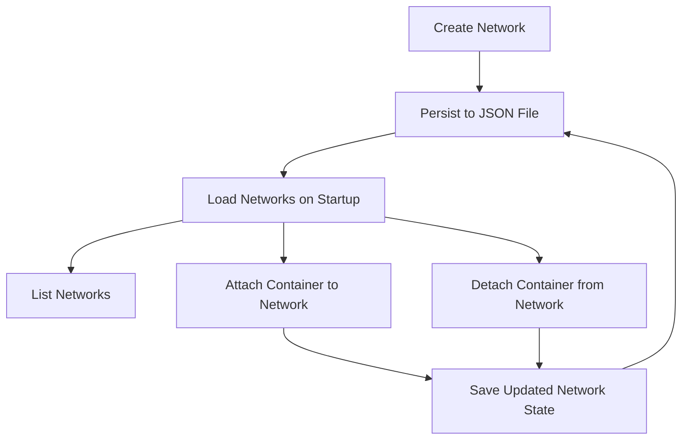

# ADR-002: Networking Stack for Basic Docker Engine

## Context
The Basic Docker Engine requires a networking stack to enable communication between containers and the host system. The networking stack should be simple, lightweight, and easy to use, aligning with the overall philosophy of the project.

## Design Goals
1. **Simplicity**: The networking stack should be easy to understand and use, with minimal configuration required.
2. **Lightweight**: Avoid unnecessary complexity or dependencies, keeping the implementation lean.
3. **Extensibility**: Provide a foundation that can be extended in the future to support advanced networking features.
4. **Isolation**: Ensure that containers within the same network can communicate while maintaining isolation from other networks.

## Decision
We implemented a basic networking stack with the following features:

1. **Network Management**:
   - Ability to create, list, and delete networks.
   - Networks are identified by a unique ID and a user-defined name.
   - Networks are persisted to a JSON file (`networks.json`) to ensure they survive program restarts.

2. **Container-to-Container Communication**:
   - Containers within the same network can communicate with each other.
   - Communication across networks is not supported in this initial implementation.

3. **Host Communication**:
   - Containers can communicate with the host system if required.

4. **Integration with Resource Capsules**:
   - Networks are treated as resource capsules, enabling versioning and dynamic attachment/detachment of containers.

5. **Implementation Details**:
   - Networks are managed in-memory and persisted to a JSON file.
   - Commands for managing networks are added to the CLI (`network-create`, `network-list`, `network-delete`, `network-attach`, `network-detach`).

## API and Code Snippets

### Network Management API

#### Create a Network
```go
func CreateNetwork(name string) {
	id := fmt.Sprintf("net-%d", len(networks)+1)
	network := Network{Name: name, ID: id, Containers: []string{}}
	networks = append(networks, network)

	// Register the network as a resource capsule
	capsuleManager.AddCapsule(name, "1.0", id)
	saveNetworks()
	fmt.Printf("Network capsule %s created with ID %s\n", name, id)
}
```

#### List Networks
```go
func ListNetworks() {
	fmt.Println("Available Networks:")
	for _, network := range networks {
		fmt.Printf("- %s (ID: %s)\n", network.Name, network.ID)
	}
}
```

#### Delete a Network
```go
func DeleteNetwork(id string) {
	for i, network := range networks {
		if network.ID == id {
			networks = append(networks[:i], networks[i+1:]...)
			saveNetworks()
			fmt.Printf("Network with ID %s deleted\n", id)
			return
		}
	}
	fmt.Printf("Network with ID %s not found\n", id)
}
```

#### Attach a Container to a Network
```go
func AttachContainerToNetwork(networkID, containerID string) error {
	for i, network := range networks {
		if network.ID == networkID {
			// Check if the container is already attached
			for _, c := range network.Containers {
				if c == containerID {
					return errors.New("container is already attached to the network")
				}
			}
			// Attach the container
			networks[i].Containers = append(network.Containers, containerID)
			saveNetworks()
			fmt.Printf("Container %s attached to network %s\n", containerID, networkID)
			return nil
		}
	}
	return errors.New("network not found")
}
```

#### Detach a Container from a Network
```go
func DetachContainerFromNetwork(networkID, containerID string) error {
	for i, network := range networks {
		if network.ID == networkID {
			// Find and remove the container
			for j, c := range network.Containers {
				if c == containerID {
					networks[i].Containers = append(network.Containers[:j], network.Containers[j+1:]...)
					saveNetworks()
					fmt.Printf("Container %s detached from network %s\n", containerID, networkID)
					return nil
				}
			}
			return errors.New("container not found in the network")
		}
	}
	return errors.New("network not found")
}
```

### Persistence
Networks are persisted to a JSON file (`networks.json`) using the following functions:

#### Save Networks
```go
func saveNetworks() {
	filePath := filepath.Join(baseDir, networksFile)
	file, err := os.Create(filePath)
	if err != nil {
		fmt.Printf("Error saving networks: %v\n", err)
		return
	}
	defer file.Close()

	encoder := json.NewEncoder(file)
	if err := encoder.Encode(networks); err != nil {
		fmt.Printf("Error encoding networks: %v\n", err)
	}
}
```

#### Load Networks
```go
func loadNetworks() {
	filePath := filepath.Join(baseDir, networksFile)
	file, err := os.Open(filePath)
	if err != nil {
		if os.IsNotExist(err) {
			return // No networks file exists yet
		}
		fmt.Printf("Error loading networks: %v\n", err)
		return
	}
	defer file.Close()

	decoder := json.NewDecoder(file)
	if err := decoder.Decode(&networks); err != nil {
		fmt.Printf("Error decoding networks: %v\n", err)
	}
}
```

### CLI Commands
- `network-create <network-name>`: Create a new network.
- `network-list`: List all networks.
- `network-delete <network-id>`: Delete a network by ID.
- `network-attach <network-id> <container-id>`: Attach a container to a network.
- `network-detach <network-id> <container-id>`: Detach a container from a network.

## Design Diagram


## Consequences
1. **Positive**:
   - The networking stack is easy to implement and use.
   - Aligns with the project's goal of being a lean and simple Docker engine.
   - Networks persist across program executions.

2. **Negative**:
   - Limited functionality compared to full-featured networking stacks.
   - Requires future work to support advanced networking features.

## Status
In Review

## Date
April 14, 2025

## Author
Basic Docker Engine Team
