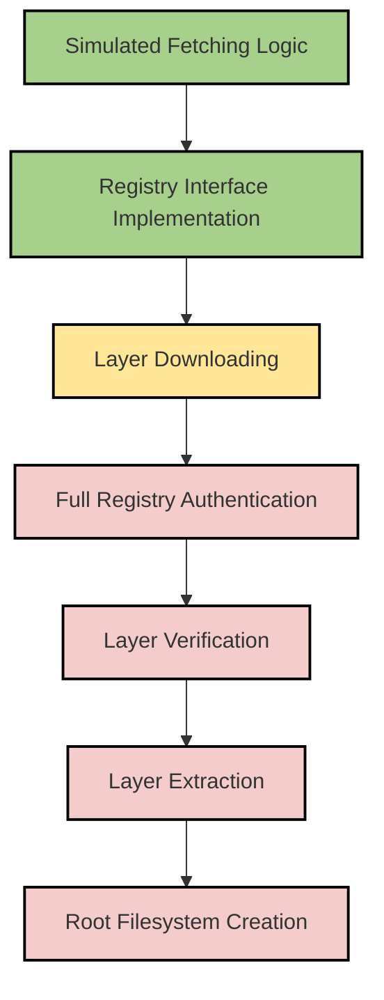

# ADR-003: Support Real Docker Image Downloads

## Status
Proposed

## Context
The current implementation of the basic Docker engine supports a simplified mechanism for handling container images. This includes listing images and simulating image fetching. However, it does not support real Docker image downloads from container registries, which limits its functionality and compatibility with standard Docker workflows.

## Decision
We will implement support for real Docker image downloads. This will involve integrating with container registries to fetch image manifests and layers, and extracting these layers to create a functional root filesystem for containers.

### Key Differences Between Current Implementation and Real Docker Image Downloads

| Feature                          | Current Implementation                          | Real Docker Implementation                  |
|----------------------------------|------------------------------------------------|---------------------------------------------|
| **Image Fetching**               | Simulated fetching with placeholder logic      | Fetches images from real container registries (e.g., Docker Hub) |
| **Manifest Handling**            | Not implemented                                | Parses and processes image manifests        |
| **Layer Downloading**            | Not implemented                                | Downloads and verifies image layers         |
| **Layer Extraction**             | Basic tar extraction                           | Handles complex layer structures and metadata |
| **Registry Authentication**      | Not supported                                  | Supports authentication for private registries |

## Consequences
1. **Benefits**:
   - Aligns the basic Docker engine with real-world Docker workflows.
   - Enables compatibility with existing container images and registries.
   - Provides a more realistic environment for learning and experimentation.

2. **Challenges**:
   - Increased complexity in implementation.
   - Requires handling of network operations, authentication, and error cases.
   - May introduce dependencies on external libraries or tools for registry interaction.

## Implementation Plan
1. **Registry Integration**:
   - Implement a `Registry` interface to abstract interactions with container registries.
   - Provide a default implementation for Docker Hub.

2. **Manifest Handling**:
   - Fetch and parse image manifests to determine required layers.

3. **Layer Downloading and Verification**:
   - Download image layers using the digests specified in the manifest.
   - Verify layer integrity using checksums.

4. **Layer Extraction**:
   - Extract layers to create a root filesystem for containers.

5. **Authentication**:
   - Add support for registry authentication to handle private images.

6. **Testing**:
   - Add unit and integration tests to ensure correctness and reliability.

## Implementation Diagram

The following diagram illustrates the current stage of implementation and the end goal for supporting real Docker image downloads:



### Explanation of Stages

1. **Implemented**:
   - Simulated fetching logic is used to mimic image downloads.
   - Basic image listing functionality is implemented.
   - The `Pull` function exists as a placeholder without real registry interaction.
   - Added support for loading images from `.tar` files.
   - Added functionality to run locally loaded images.
   - Registry interface implementation for local registries is complete.

2. **In Progress**:
   - Add functionality for downloading image layers from registries.

3. **Not Started**:
   - Support full registry authentication, including private registries.
   - Verify the integrity of downloaded layers using checksums.
   - Extract layers to create a functional root filesystem for containers.
   - Achieve compatibility with real Docker workflows.

## Updates: Local Registry and Tar Functionality

### Local Registry Support
We added support for pulling images from a local registry. The `run` command now parses the registry URL directly from the image name. For example:

```bash
./basic-docker run localhost:5000/alpine /bin/sh -c "echo Hello from local registry"
```

This allows users to specify images hosted on a local registry (e.g., `localhost:5000`) or any custom registry URL.

### Tar File Loading
We also implemented functionality to load images from `.tar` files. This is useful for offline environments or pre-packaged images. The `load` command can be used as follows:

```bash
./basic-docker load alpine.tar
```

After loading, the image can be verified using the `images` command:

```bash
./basic-docker images
```

The output will include the image name, size, and whether its content is verified.

### Example Workflow
1. **Load an Image from a Tar File**:
   ```bash
   ./basic-docker load busyboximage.tar
   ```
   Output:
   ```
   Loading image from 'busyboximage.tar'...
   Image 'busyboximage' loaded successfully.
   ```

Create the registry

 $ docker run -d -p 5000:5000 --name registry registry:2
Unable to find image 'registry:2' locally
2: Pulling from library/registry
44cf07d57ee4: Pull complete 
bbbdd6c6894b: Pull complete 
8e82f80af0de: Pull complete 
3493bf46cdec: Pull complete 
6d464ea18732: Pull complete 
Digest: sha256:a3d8aaa63ed8681a604f1dea0aa03f100d5895b6a58ace528858a7b332415373
Status: Downloaded newer image for registry:2
d317a23d345324b5e4dc71c33f2548244b5ed0b877b44917db605ec856bfc431

$ ./basic-docker run localhost:5000/alpine /bin/sh -c "echo Hello from local registry"
Environment detected: inContainer=true, hasNamespacePrivileges=true, hasCgroupAccess=false
Fetching image 'localhost:5000/alpine' from registry...
Image 'localhost:5000/alpine' fetched successfully.
Starting container container-1745001780
Warning: Namespace isolation is not permitted. Executing without isolation.
Hello from local registry

2. **Run an Image from a Local Registry**:
   ```bash
   ./basic-docker run localhost:5000/alpine /bin/sh -c "echo Hello from local registry"
   ```
   Output:
   ```
   Fetching image 'localhost:5000/alpine' from registry...
   Image 'localhost:5000/alpine' fetched successfully.
   Starting container container-1234567890
   Hello from local registry
   ```

3. **List Images**:
   ```bash
   ./basic-docker images
   ```
   Output:
   ```
   IMAGE NAME      SIZE        CONTENT VERIFIED
   busyboximage    4530692     Yes
   localhost:5000/alpine   1234567     Yes
   ```

## Alternatives Considered
1. **Continue with Simulated Fetching**:
   - Simpler to implement but limits functionality.

2. **Use a Third-Party Library**:
   - Reduces development effort but may introduce external dependencies.

## Decision Drivers
- Need for realistic Docker functionality.
- Compatibility with existing container images and workflows.
- Balance between implementation complexity and feature completeness.

## References
- [Docker Image Specification](https://github.com/moby/moby/blob/master/image/spec/v1.2.md)
- [OCI Image Format Specification](https://github.com/opencontainers/image-spec)

