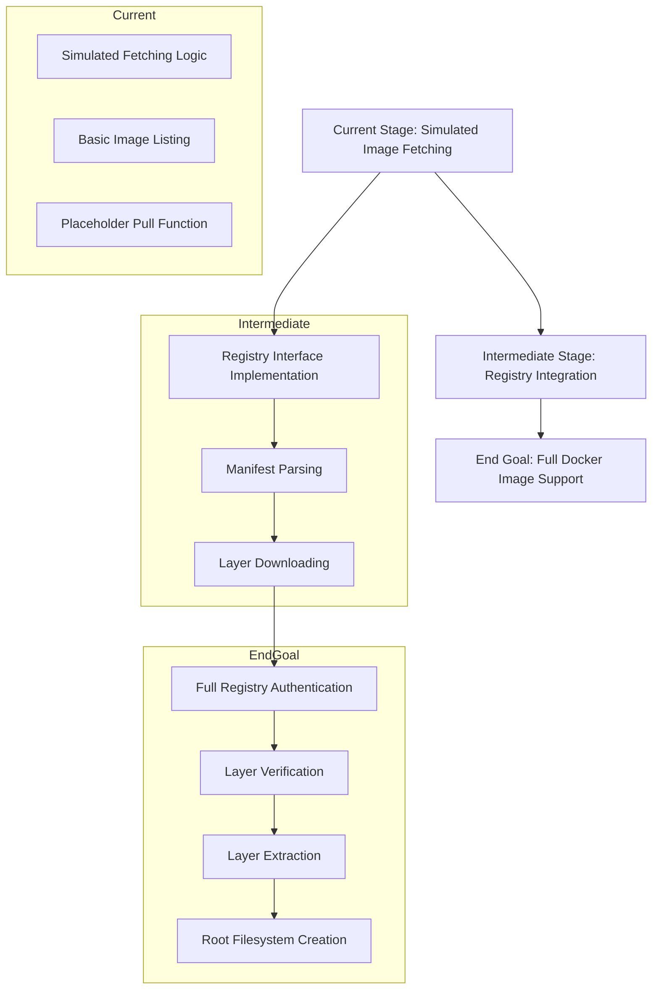

# ADR-003: Support Real Docker Image Downloads

## Status
Proposed

## Context
The current implementation of the basic Docker engine supports a simplified mechanism for handling container images. This includes listing images and simulating image fetching. However, it does not support real Docker image downloads from container registries, which limits its functionality and compatibility with standard Docker workflows.

## Decision
We will implement support for real Docker image downloads. This will involve integrating with container registries to fetch image manifests and layers, and extracting these layers to create a functional root filesystem for containers.

### Key Differences Between Current Implementation and Real Docker Image Downloads

| Feature                          | Current Implementation                          | Real Docker Implementation                  |
|----------------------------------|------------------------------------------------|---------------------------------------------|
| **Image Fetching**               | Simulated fetching with placeholder logic      | Fetches images from real container registries (e.g., Docker Hub) |
| **Manifest Handling**            | Not implemented                                | Parses and processes image manifests        |
| **Layer Downloading**            | Not implemented                                | Downloads and verifies image layers         |
| **Layer Extraction**             | Basic tar extraction                           | Handles complex layer structures and metadata |
| **Registry Authentication**      | Not supported                                  | Supports authentication for private registries |

## Consequences
1. **Benefits**:
   - Aligns the basic Docker engine with real-world Docker workflows.
   - Enables compatibility with existing container images and registries.
   - Provides a more realistic environment for learning and experimentation.

2. **Challenges**:
   - Increased complexity in implementation.
   - Requires handling of network operations, authentication, and error cases.
   - May introduce dependencies on external libraries or tools for registry interaction.

## Implementation Plan
1. **Registry Integration**:
   - Implement a `Registry` interface to abstract interactions with container registries.
   - Provide a default implementation for Docker Hub.

2. **Manifest Handling**:
   - Fetch and parse image manifests to determine required layers.

3. **Layer Downloading and Verification**:
   - Download image layers using the digests specified in the manifest.
   - Verify layer integrity using checksums.

4. **Layer Extraction**:
   - Extract layers to create a root filesystem for containers.

5. **Authentication**:
   - Add support for registry authentication to handle private images.

6. **Testing**:
   - Add unit and integration tests to ensure correctness and reliability.

## Implementation Diagram

The following diagram illustrates the current stage of implementation and the end goal for supporting real Docker image downloads:

### Explanation of Stages

1. **Current Stage**:
   - Simulated fetching logic is used to mimic image downloads.
   - Basic image listing functionality is implemented.
   - The `Pull` function exists as a placeholder without real registry interaction.

2. **Intermediate Stage**:
   - Introduce a `Registry` interface to abstract interactions with container registries.
   - Implement manifest parsing to identify required layers.
   - Add functionality for downloading image layers from registries.

3. **End Goal**:
   - Support full registry authentication, including private registries.
   - Verify the integrity of downloaded layers using checksums.
   - Extract layers to create a functional root filesystem for containers.
   - Achieve compatibility with real Docker workflows.

## Alternatives Considered
1. **Continue with Simulated Fetching**:
   - Simpler to implement but limits functionality.

2. **Use a Third-Party Library**:
   - Reduces development effort but may introduce external dependencies.

## Decision Drivers
- Need for realistic Docker functionality.
- Compatibility with existing container images and workflows.
- Balance between implementation complexity and feature completeness.

## References
- [Docker Image Specification](https://github.com/moby/moby/blob/master/image/spec/v1.2.md)
- [OCI Image Format Specification](https://github.com/opencontainers/image-spec)